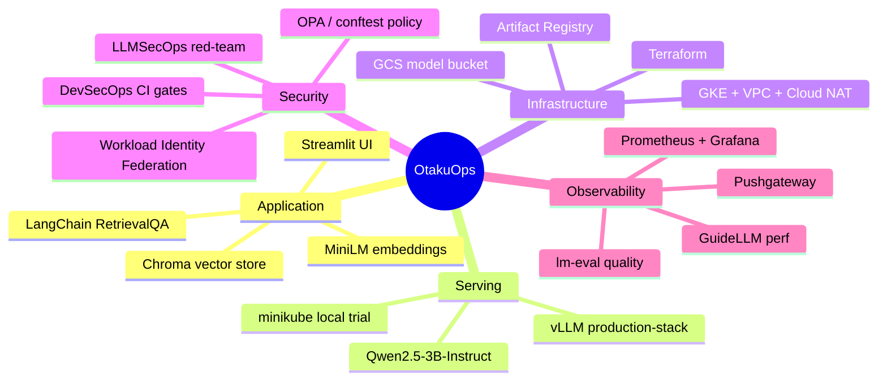
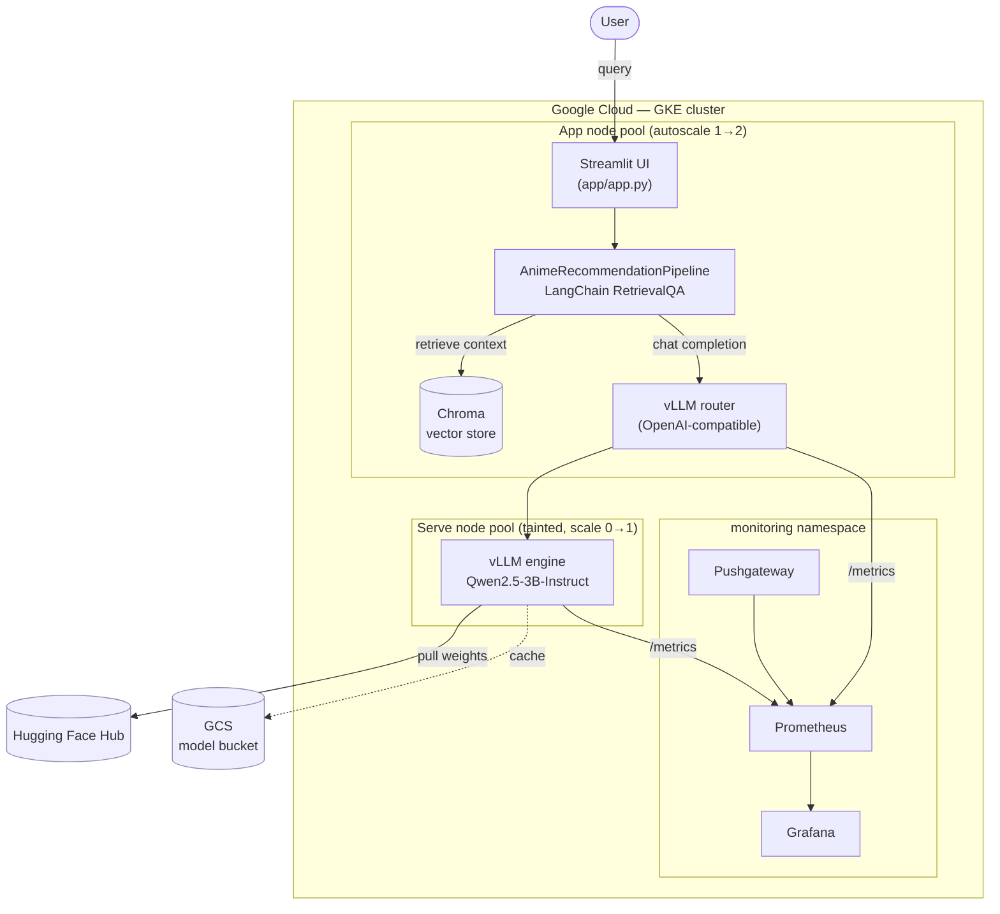
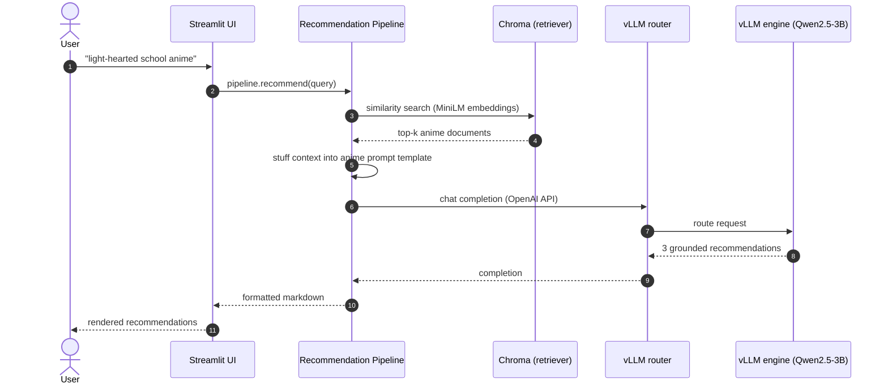
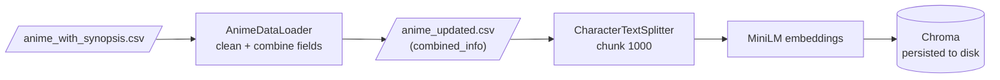
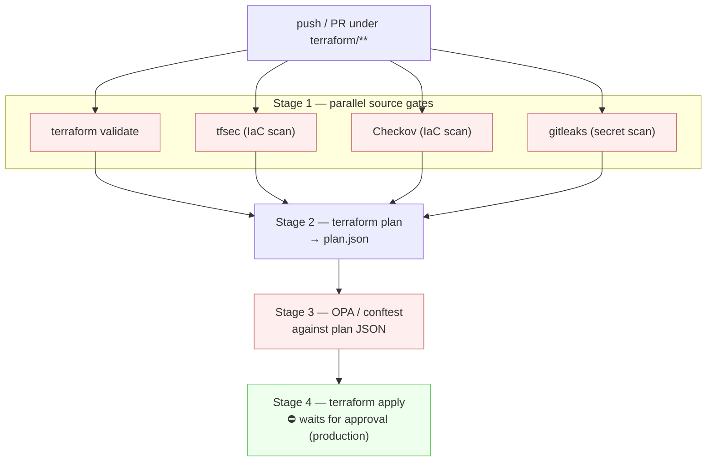
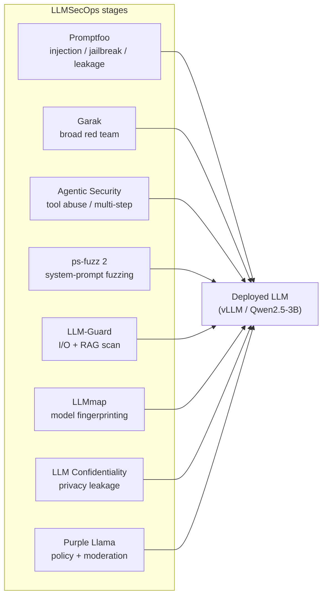
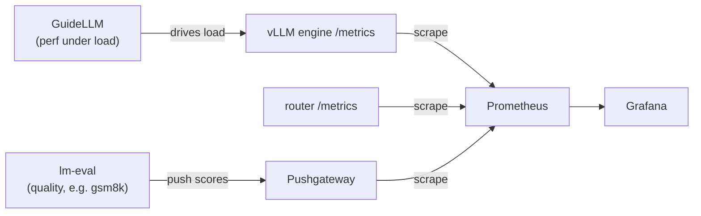

# OtakuOps

> **A security-gated, self-hosted LLM platform on GKE — with an anime RAG recommender as the reference workload.**

OtakuOps is an end-to-end **LLMOps / LLMSecOps** reference platform. The user-facing product is a retrieval-augmented anime recommender, but the point of the project is everything *around* the model: infrastructure as code, a self-hosted LLM, a DevSecOps CI/CD pipeline, full observability, and an eight-tool LLM red-team suite — all engineered to run inside a **CPU-only, $300 free-tier budget**.

<p align="left">
  
  
  
  
</p>

---

## Table of contents

- [What it is](#what-it-is)
- [System architecture](#system-architecture)
- [How a recommendation is served](#how-a-recommendation-is-served)
- [The offline build pipeline](#the-offline-build-pipeline)
- [DevSecOps CI/CD](#devsecops-cicd)
- [LLMSecOps red-team suite](#llmsecops-red-team-suite)
- [Observability & evaluation](#observability--evaluation)
- [Tech stack](#tech-stack)
- [Repository layout](#repository-layout)
- [Getting started](#getting-started)
- [Free-tier reality](#free-tier-reality)

---

## What it is

At the surface, a user types a preference — *"light-hearted anime with a school setting"* — and gets three tailored recommendations with plot summaries and reasons. Under the hood:

- **RAG**, not fine-tuning. Anime synopses are embedded with `all-MiniLM-L6-v2`, stored in **Chroma**, and retrieved at query time to ground a `RetrievalQA` chain.
- **Self-hosted inference.** The LLM is **Qwen2.5-3B-Instruct** served by the **vLLM production-stack** on GKE. The same stack runs locally on **minikube** (with a lightweight SLM) for fast, cluster-realistic iteration before touching the cloud.
- **Everything is code.** The cluster, network, storage, and registry are provisioned by **Terraform**; every deploy runs through a security-gated GitHub Actions pipeline.



---

## System architecture



**Two-pool design.** Lightweight, always-on components (UI, pipeline, router) live on a small **app pool** that autoscales `1→2`. The heavy **vLLM engine** lives on a dedicated, tainted **serve pool** that scales `0→1` only when needed — so you never pay for a large node while idle. The router is the single OpenAI-compatible entry point the app talks to.

---

## How a recommendation is served



The prompt template (`src/prompt_template.py`) constrains the model to exactly three titles, each with a summary and a match rationale, and instructs it to refuse rather than hallucinate when the context is insufficient.

---

## The offline build pipeline

Before anything is served, the vector store has to be built from raw data. This is a one-off (or on-data-change) job.



`AnimeDataLoader` merges title, synopsis, and genres into a single `combined_info` field; `VectorStoreBuilder` chunks, embeds, and persists it to a local Chroma directory that the runtime pipeline then loads read-only.

---

## DevSecOps CI/CD

Nothing reaches the cluster without passing security gates. The infra pipeline is representative — **four stages, parallel source gates, policy-as-code against the resolved plan, and an approval-gated apply**.



The same DevSecOps shape is reused across pipelines:


| Workflow                   | Deploys                             | Key gates                                                             |
| -------------------------- | ----------------------------------- | --------------------------------------------------------------------- |
| `infra-build.yml`          | GKE + VPC + GCS + Artifact Registry | validate · tfsec · Checkov · gitleaks ·**OPA policy** → approval |
| `vllm-deploy.yml`          | vLLM production-stack (CPU)         | Helm render · kubeconform → approval                                |
| `observability-deploy.yml` | Prometheus/Grafana + Pushgateway    | kubeconform · Checkov · gitleaks → approval                        |
| `llmsecops.yml`            | LLM red-team stages                 | per-tool, manual dispatch                                             |

Auth is **keyless** throughout via **Workload Identity Federation** — no service-account JSON keys in secrets. SARIF findings surface in the GitHub Security tab.

---

## LLMSecOps red-team suite

`llmsecops.yml` runs a menu of security tools against the live model, each as an isolated, approval-gated stage. Pick `all` or a single tool.



This maps the platform against real LLM threat classes — prompt injection, jailbreaks, data exfiltration, model fingerprinting, and policy/moderation compliance.

---

## Observability & evaluation

Three kinds of measurement land in one Grafana:



- **Serving metrics** — tokens/s, TTFT, end-to-end latency, queue depth, KV-cache — scraped live from the engine and router.
- **GuideLLM** drives controlled load so you can see behavior under pressure in the serving panels.
- **lm-eval** runs task-based quality benchmarks and **pushes** scores to the Pushgateway (`lm_eval_score{task="gsm8k"}`).

See [`k8s/observability/README.md`](k8s/observability/README.md) for PromQL panels and the manual install order.

---

## Tech stack


| Layer              | Technology                                                             |
| ------------------ | ---------------------------------------------------------------------- |
| **UI**             | Streamlit                                                              |
| **Orchestration**  | LangChain (`RetrievalQA`)                                              |
| **Vector store**   | Chroma                                                                 |
| **Embeddings**     | `sentence-transformers/all-MiniLM-L6-v2`                               |
| **LLM (cloud)**    | Qwen2.5-3B-Instruct via vLLM production-stack                          |
| **LLM (local)**    | Lightweight SLM via vLLM on minikube                                   |
| **Cloud**          | Google Kubernetes Engine (GKE)                                         |
| **Local cluster**  | minikube (CPU, self-hosted vLLM)                                       |
| **IaC**            | Terraform (modular: network · gke · storage · artifact_registry)    |
| **CI/CD**          | GitHub Actions + Workload Identity Federation                          |
| **Security**       | tfsec · Checkov · gitleaks · OPA/conftest · 8-tool LLMSecOps suite |
| **Observability**  | kube-prometheus-stack · Grafana · Pushgateway · GuideLLM · lm-eval |

---

## Repository layout

```
.
├── app/                  # Streamlit entrypoint
├── src/                  # RAG core: data_loader, vector_store, llm_provider,
│                         #   prompt_template, recommender
├── pipeline/             # build_pipeline (offline) + pipeline (runtime)
├── config/               # env-driven config (LLM provider, vLLM settings)
├── data/                 # anime datasets (raw + processed)
├── utils/                # logger + custom exceptions
├── terraform/            # modular IaC + OPA policies + CI backend
│   ├── modules/          #   network · gke · storage · artifact_registry
│   └── policy/           #   gke.rego · storage.rego (conftest)
├── k8s/
│   ├── app/              # app Deployment + Service
│   ├── production-stack/ # vLLM CPU values
│   └── observability/    # Prometheus/Grafana values, Pushgateway, eval Jobs
├── k8s-local/            # minikube manifests (local dev)
├── .github/workflows/    # infra · vllm · observability · llmsecops pipelines
├── dockerfile            # app container image
└── requirements.txt
```

---

## Getting started

### Local trial (minikube — self-hosted vLLM, no cloud needed)

Runs the whole thing on your machine: a CPU vLLM server (lightweight SLM) and the app,
both inside a local minikube cluster — the same architecture as GKE, in miniature.

```bash
# build the vector store (one-off) — see build_pipeline for details
python pipeline/build_pipeline.py

# start minikube, build the app image into it, then deploy vLLM + app
minikube start
eval "$(minikube docker-env)" && docker build -t anime-rec-app:latest .
kubectl apply -f k8s-local/

# open the UI
minikube service anime-rec-service
```

### Self-hosted (vLLM on GKE)

```bash
# 1) provision the cluster (or push to trigger the gated pipeline)
cd terraform && terraform init && terraform apply

# 2) deploy the vLLM production-stack (CPU)
helm upgrade --install vllm vllm/vllm-stack -n default \
  -f k8s/production-stack/values-cpu.yaml

# 3) deploy the app (defaults to LLM_PROVIDER=vllm, talks to the router)
kubectl apply -f k8s/app/
```

> In-cluster, the app defaults to the router at
> `http://vllm-router-service.default.svc.cluster.local:80/v1` serving `Qwen/Qwen2.5-3B-Instruct` —
> no API key required. Configuration lives in `config/config.py`.

---

## Free-tier reality

This platform is deliberately engineered to fit an **8-vCPU / $300 credit, CPU-only** budget — which drives most of the non-obvious design choices:

- **No GPUs.** vLLM runs the `vllm-openai-cpu` image with `float32` weights (this CPU lacks AVX512-BF16), `--enforce-eager`, a 4096 context, and generous startup probes because **CPU warmup is slow** (~25 min to healthy).
- **Scale-to-zero serve pool.** The large serve node only exists while the engine is up.
- **Trimmed monitoring.** No Alertmanager, 2-day retention, small requests — the full kube-prometheus-stack alone wants ~1.5–2 vCPU.
- **Cost discipline.** Run eval Jobs, read the numbers, delete them; scale monitoring down when not demoing.

The tradeoffs (e.g. deferring `llm-d`, keeping benchmarks small) are tracked as explicit constraints, not accidents.

---

<sub>OtakuOps — a portfolio-grade demonstration that the hard part of shipping an LLM feature is the platform around the model, not the model itself.</sub>
